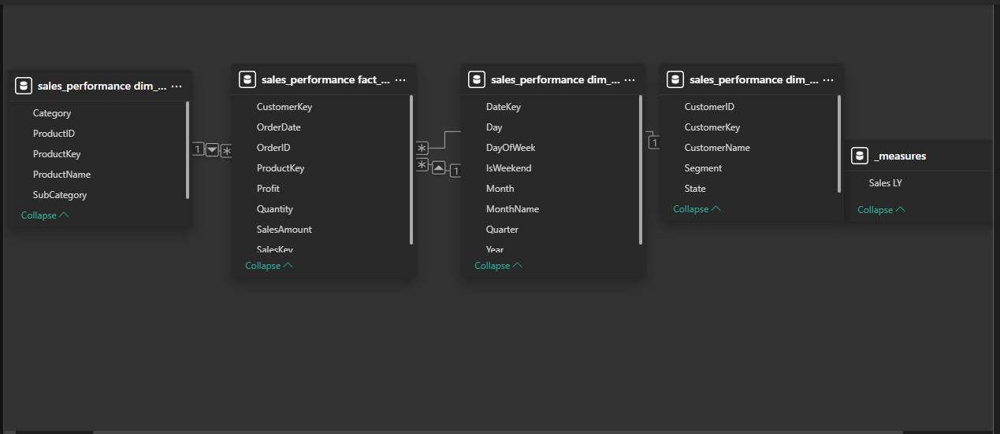

# Interactive-Sales-Dashboard-MYSQL-PowerBI
"End-to-end sales analysis using MySQL and Power BI featuring YoY growth and regional deep-dives."

# Sales Performance & Regional Analysis (2014-2017)

## 📊 Project Overview
This project provides a comprehensive analysis of a multi-year retail dataset. I built an end-to-end BI solution that transforms raw MySQL data into an interactive Power BI dashboard, enabling stakeholders to track YoY growth, regional profitability, and product category performance.

## 🛠️ Tech Stack
- **Database:** MySQL (Data Cleaning, Star Schema Design, Recursive CTEs)
- **BI Tool:** Power BI Desktop
- **Language:** DAX (Data Analysis Expressions) for Time Intelligence
- **Modeling:** Star Schema (1:Many Relationships)

## 🚀 Key Features & Solved Challenges
- **Recursive CTE Date Table:** Engineered a contiguous `dim_date` table in MySQL using recursive logic to ensure 100% accuracy in Time Intelligence calculations.
- **Advanced DAX Measures:** Developed custom measures for **Total Sales**, **Sales LY**, and **YoY Growth %** to identify performance trends.
- **Dark Mode UI/UX:** Designed a high-contrast dashboard optimized for executive presentations.

## 📊 Dashboard Preview

## 🏗️ Data Model (Star Schema)

## 📈 Key Insights
1. **Growth Trends:** Achieved a consistent **18.07% YoY Growth**, with 2017 showing the strongest Q4 performance.
2. **Category Mix:** Technology remains the dominant category, contributing to 40% of the total revenue.

## 📂 Repository Structure
- `/SQL_Scripts`: Contains table schemas and the recursive date generator.
- `/Dashboard`: The `.pbix` file (Power BI source file).
- `/Screenshots`: Visual preview of the final dashboard.
